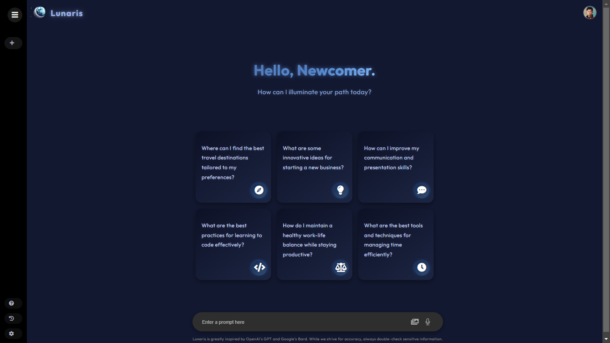

# Lunaris - A Lunar-Themed Web App Powered by Gemini API

Welcome to Lunaris, a lunar-themed web application powered by the Gemini API! 🚀🌕 This project is inspired by the Gemini API, and the goal was to build my own version of Gemini. As I’m deep into AI and Deep Learning, I initially aimed to train a model from scratch. However, given the limitations of my laptop, I decided to integrate the Gemini API and focus on building a functional, responsive, and engaging web app.

  

## Features
- **Gemini API Integration**: Powered by Gemini API, Lunaris offers the ability to interact with generative AI and provide dynamic responses.
- **User Authentication**: Users can create accounts, log in via GitHub and Google, and manage their profiles with usernames and profile pictures.
- **Responsive & Smooth UI**: I focused on creating a robotic and modern design with smooth animations, providing a user-friendly experience. It is responsive and mobile-friendly.
- **Formatting Raw API Response**: The biggest challenge was formatting the raw response from the Gemini API, which I tackled using various techniques to ensure the data is displayed as neatly as possible (though there’s still room for improvement!).
- **Typing Effect**: Added an engaging typing effect to make the responses feel interactive and engaging.
- **User Management**: Users can set configurations such as username, profile picture, and manage their login options.
- **Email Notifications**: Integrated EmailJS for sending emails (e.g., confirmation emails or notifications).
- **Smooth Routing & Components**: Built using ReactJS with a variety of dependencies like React Router for routing, Counterup for animations, and React Markdown for rendering markdown content.

  
  
## Tech Stack
- **Frontend**: 
  - ReactJS
  - Vite (for fast bundling)
  - Bootstrap (for styling)
  - React Router (for routing)
  - React Helmet (for managing head tags)
  - React Markdown & Remark-GFM (for markdown rendering)
  - jQuery & WOW.js (for smooth animations and UI effects)
  - Counterup (for animated number counters)
- **Backend**:
  - **Gemini API** (used for generative AI responses)
  - **Clerk** (for user authentication)
  - **EmailJS** (for sending emails)

## Key Challenges
- **API Response Formatting**: The raw response from the Gemini API presented some formatting issues. However, I applied various techniques and methods to convert the raw response into a cleaner, more readable format.
- **UI Design**: The biggest fun and challenge were creating a futuristic "robotic" design. I wanted the UI to be smooth, modern, and responsive with seamless animations. It’s still a work in progress, but I’m happy with how it’s come together!

## Live Demo
Check out the live version of Lunaris here: [Lunaris AI Web App](https://lunarisai.vercel.app/)

## Current Status
Lunaris is a work in progress, and while the core functionality is in place, there is still a lot to implement. As I continue to learn and grow, I’ll keep adding new features and improvements.

## Contribute
Feel free to contribute to the project! I would love to have others help improve it. You can:
- Open issues with bug reports or feature requests
- Submit pull requests with improvements, fixes, or new features

I’m always open to suggestions and improvements, and I’d love to learn and grow together with the community. 😊

## Roadmap
- **User Preferences**: Allow users to save preferences for a more personalized experience.
- **Improved API Response Formatting**: Continue refining the display of AI responses.
- **New Features**: Implement more generative AI use cases and make the app more interactive.
- **UI Enhancements**: Continue to improve the UI and add more animations and transitions.

Currently, two official plugins are available:

- [@vitejs/plugin-react](https://github.com/vitejs/vite-plugin-react/blob/main/packages/plugin-react/README.md) uses [Babel](https://babeljs.io/) for Fast Refresh
- [@vitejs/plugin-react-swc](https://github.com/vitejs/vite-plugin-react-swc) uses [SWC](https://swc.rs/) for Fast Refresh
